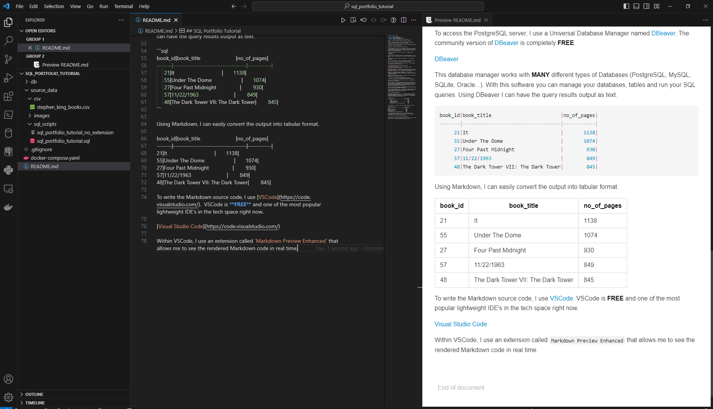

## SQL Portfolio Tutorial

**Author**: Jaime M. Shaker <br />
**Email**: jaime.m.shaker@gmail.com <br />
**Website**: https://www.shaker.dev <br />
**LinkedIn**: https://www.linkedin.com/in/jaime-shaker/  <br />

### How to create an SQL/Data Analytics portfolio on Github

A simple, one page tutorial on how to use the Markdown language to showcase your SQL/Data Analytics portfolio on Github.

:exclamation: If you find this repository helpful, please consider giving it a :star:. Thanks! :exclamation:

#### How can I have my SQL portfolio look like yours?

A common request that I get is for assistance in making an SQL portfolio more professional looking that just plain SQL code in a file.  I hope this short tutorial helps others with creating a better presentation for their Data Analytics/SQL projects.

All of my SQL projects consist of at least two (2) separate files.  
- SQL File
- Markdown File

The SQL file is the file that consist of the actual SQL code.  This should be pretty self-explanatory, but I do want to mention an important note. 

:exclamation:  Make sure to give your SQL file an `.sql` extension! :exclamation: 

With a `.sql` extension your file will have syntax highlighting which will make it much easier to read and appear much more professional looking.

Note the difference between the following two files.  One file has the `.sql` extension, the other does not.

- [sql_portfolio_sql.sql](./source_data/sql_scripts/sql_portfolio_tutorial.sql)
- [sql_portfolio_sql_no_extension](./source_data/sql_scripts/sql_portfolio_tutorial_no_extension)

Same exact code but the file extension changes everything.

Other than the SQL file, I also include a presentation file written in the Markdown language.  This very file that you are reading is a Markdown file as you can tell my the `.md` extension in the file name.

Markdown is a lightweight markup language that you can use to add formatting elements to plaintext text documents.  Markdown is similar but much simpler than HTML.

Markdown can be learned in as little as 15 minutes.  You can learn more about Markdown at the following links.  

- [Markdown Tutorial](https://www.markdowntutorial.com/)
- [Markdown Guide](https://www.markdownguide.org/getting-started/)

However, if you follow along with my [source code](https://raw.githubusercontent.com/iweld/sql_portfolio_tutorial/main/README.md?token=GHSAT0AAAAAACHE5256YAFERDD3WJZ3D3E4ZJCBUWA), if should not be too difficult to comprehend.  Markdown is very simple.

For this tutorial, I am using PostgreSQL within a Docker container to run the .sql scripts. If you would like to do the same but don't know how, you can follow this walkthrough and it will guide you on how to create a PostgreSQL container within Docker. Very useful information and not difficult but not necessary for this tutorial.

[Docker/PostgreSQL Guide](https://github.com/iweld/SQL_Coding_Challenge/blob/main/walkthrough/WALKTHROUGH_1_DOCKER.md)

To access the PostgreSQL server, I use a Universal Database Manager named [DBeaver](https://dbeaver.io/).  The community version of [DBeaver](https://dbeaver.io/) is completely **FREE**.  

[DBeaver](https://dbeaver.io/)

This database manager works with **MANY** different types of Databases (PostgreSQL, MySQL, SQLite, Oracle...).  With this software you can manage your databases, tables and run your SQL queries.  Using DBeaver I can have the query results output as text.

```sql
book_id|book_title                        |no_of_pages|
-------|----------------------------------|-----------|
     21|It                                |       1138|
     55|Under The Dome                    |       1074|
     27|Four Past Midnight                |        930|
     57|11/22/1963                        |        849|
     48|The Dark Tower VII: The Dark Tower|        845|
```

Using Markdown, I can easily convert the output into a tabular format.

book_id|book_title                        |no_of_pages|
-------|----------------------------------|-----------|
21|It                                |       1138|
55|Under The Dome                    |       1074|
27|Four Past Midnight                |        930|
57|11/22/1963                        |        849|
48|The Dark Tower VII: The Dark Tower|        845|

To write the Markdown source code, I use [VSCode](https://code.visualstudio.com/).  VSCode is **FREE** and one of the most popular lightweight IDE's in the tech space right now.

[Visual Studio Code](https://code.visualstudio.com/)

Within VSCode, I use an extension called `Markdown Preview Enhanced` that allows me to see the rendered Markdown code in real time.



So within my Github repository, I will have a `my_queries.sql` file to show the actual SQL queries **AND** I will have a separate `my_queries.md` file to display the page in a cleaner format.

Within Markdown, I can show the actual SQL (or any programming/scripting language) by enclosing the code within a code block like so...


````markdown
```sql
	SELECT DISTINCT 
		column_name
	FROM 
		some_table
	WHERE
		column_name IS NOT NULL;
```
````

This will allow your SQL code (or any programming/scripting code for that matter) to be rendered with syntax highlighting and proper formatting like so...

```sql
	SELECT DISTINCT 
		column_name
	FROM 
		some_table
	WHERE
		column_name IS NOT NULL;
```

I have created a small SQL file to show a practical example on how this could be used.  Follow the example below.

#### Markdown File Example

**1**. How many records are in our table?

```sql
SELECT 
	COUNT(*) AS book_count
FROM
	stephen_king.books;
```

**Results**:

book_count|
----------|
75|

:exclamation:  We can put either our query or the results inside the \<details>Your Code Here\</details> to hide the text until it is clicked. :exclamation: 

<p>

**2**. List the book id, capitalized title and number of pages from the top 5 books with greatest number of pages.

**Expected Results**:

book_id|book_title                        |no_of_pages|
-------|----------------------------------|-----------|
21|It                                |       1138|
55|Under The Dome                    |       1074|
27|Four Past Midnight                |        930|
57|11/22/1963                        |        849|
48|The Dark Tower VII: The Dark Tower|        845|

<details>
  <summary>Click to expand the Answer!</summary>

  ##### Answer:

```sql
SELECT 
	book_id,
	INITCAP(book_title) AS book_title,
	no_of_pages
FROM
	stephen_king.books
ORDER BY 
	no_of_pages DESC
LIMIT 5;
```
</details>
</p>

**3**. List the amount of time (in years) that have passed since the first published book and the last published book.

```sql
SELECT
	MIN(year_published) AS first_published,
	MAX(year_published) AS last_published,
	(MAX(year_published) - MIN(year_published)) AS years_passed
FROM
	stephen_king.books;
```

**Results**:

first_published|last_published|years_passed|
---------------|--------------|------------|
1974|          2022|          48|

As you can see, You will have to copy the SQL code, the query results and then paste it onto the markdown file. 

This is some extra work, but I think it looks much better and it's a great way to showcase your technical abilities and attention to detail.

I hope this helps you.  Feel free to message me if you have any questions or want to show off your work!  Good luck!

:exclamation: If you find this repository helpful, please consider giving it a :star:. Thanks! :exclamation: